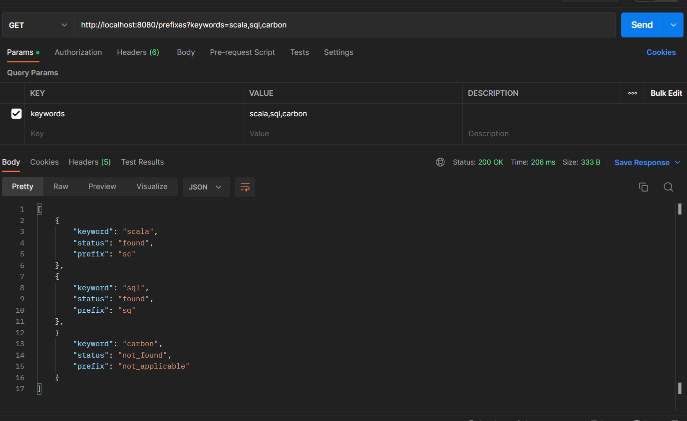

# Kotlin SpringBootProject

dataset = [
    "java",
"python",
"cpp",
"javascript",
"swift",
"kotlin",
"ruby",
"php",
"go",
"scala",
"r",
"sql",
"perl",
"lua",
"objective-c",
"typescript",
"haskell",
"dart",
"rust",
"visual basic",
"assembly",
"cobol",
"fortran",
"lisp"
]

